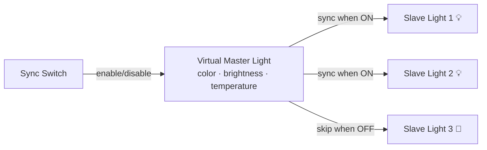

# Light Sync Master for Home Assistant

A custom Home Assistant integration that creates a virtual master light to synchronize multiple slave lights in real-time.

[](https://github.com/custom-components/hacs)
[](https://github.com/gabry-ts/ha-light-sync-master/releases)
[](https://github.com/gabry-ts/ha-light-sync-master)
[](./LICENSE)
[](https://www.home-assistant.io/)

## Why

Controlling multiple lights individually is tedious. Grouping them in Home Assistant makes them act as one, but you lose per-light control.

**Light Sync Master** gives you both: change the master and all ON slave lights follow. Turn a slave OFF and it's independent again. Simple.

## How It Works



- **Master changes** → all ON slave lights update instantly
- **Slave turns ON** → automatically adopts master state
- **Slave is OFF** → not affected by master changes
- **Sync switch OFF** → no propagation, lights keep their state

## Features

- **Virtual Master Light** — always-on entity that stores color, brightness, and temperature
- **Real-time Sync** — event-driven, no polling
- **Sync Switch** — enable/disable with one tap
- **Auto-sync on Turn On** — slave lights match master when turned on
- **Persistent State** — survives Home Assistant restarts
- **Smooth Transitions** — configurable 0-10 seconds
- **UI Configuration** — no YAML required
- **Multi-language** — English and Italian

## Installation

### HACS (Recommended)

1. Open HACS → Integrations → ⋮ → Custom repositories
2. Add `https://github.com/gabry-ts/ha-light-sync-master` (category: Integration)
3. Install **Light Sync Master**
4. Restart Home Assistant

### Manual

1. Copy `custom_components/light_sync_master/` to your HA config directory
2. Restart Home Assistant

## Setup

1. **Settings** → **Devices & Services** → **+ Add Integration**
2. Search for **Light Sync Master**
3. Name your master light (e.g., "Master Bedroom")
4. Select the slave lights
5. Done — two entities are created:

| Entity | Description |
|--------|-------------|
| `light.lsm_<name>` | Virtual master light |
| `switch.lsm_<name>` | Sync enable/disable switch |

## Options

Click **Configure** on the integration card to modify:

- **Slave lights** — add or remove
- **Default sync state** — sync ON or OFF after restart
- **Immediate sync on enable** — sync all ON slaves when switch is turned on
- **Transition time** — 0-10 seconds for smooth changes
- **Debug logging** — detailed logs for troubleshooting

## Use Cases

- Synchronizing bedroom lamps
- Coordinating living room lighting
- Managing multiple RGB strips as one
- Creating unified scenes across rooms

## Example Automation

```yaml
automation:
  - alias: "Disable sync at bedtime"
    trigger:
      - platform: time
        at: "23:00:00"
    action:
      - service: switch.turn_off
        target:
          entity_id: switch.lsm_master_bedroom

  - alias: "Enable sync in morning"
    trigger:
      - platform: time
        at: "07:00:00"
    action:
      - service: switch.turn_on
        target:
          entity_id: switch.lsm_master_bedroom
```

## Lovelace Card

```yaml
type: vertical-stack
cards:
  - type: light
    entity: light.lsm_master_bedroom
    name: Master Bedroom Light
  - type: entities
    entities:
      - entity: switch.lsm_master_bedroom
        name: Sync Enabled
  - type: entities
    title: Slave Lights
    entities:
      - light.bedroom_lamp_1
      - light.bedroom_lamp_2
      - light.hallway_spots
```

## Troubleshooting

| Problem | Solution |
|---------|----------|
| Master doesn't sync slaves | Check sync switch is ON and slaves are turned ON |
| Slave not in selection list | Verify it's a `light` entity, restart HA |
| Sync feels slow | Reduce transition time, check HA performance |

Enable debug logging:

```yaml
logger:
  default: info
  logs:
    custom_components.light_sync_master: debug
```

## Technical Details

- **Platform**: Home Assistant 2024.1+
- **Language**: Python 3.11+
- **Configuration**: UI-based (config_flow)
- **State**: RestoreEntity for persistence
- **Architecture**: Event-driven (no polling)
- **Color Modes**: RGB, HS, XY, Color Temperature

## Limitations (v1.0)

- Master light is always ON (by design)
- Light effects are not synchronized
- No bidirectional sync (slave → master)
- No per-slave attribute selection

## Contributing

Contributions welcome! Fork, branch, and submit a PR.

## License

[MIT](./LICENSE)
